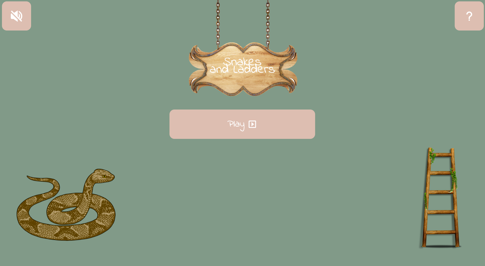
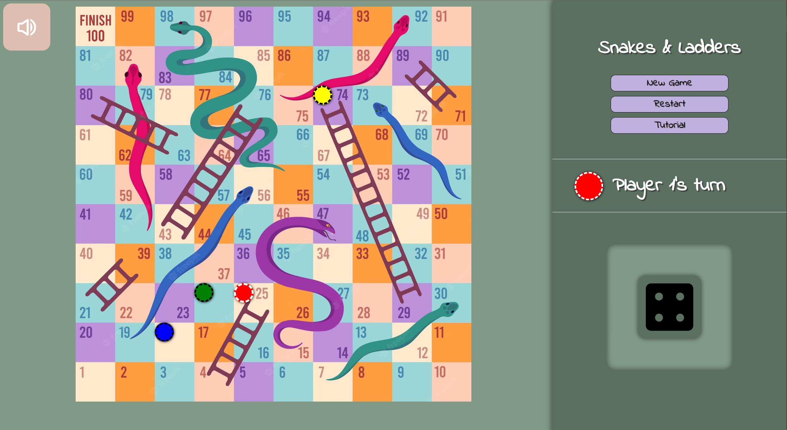
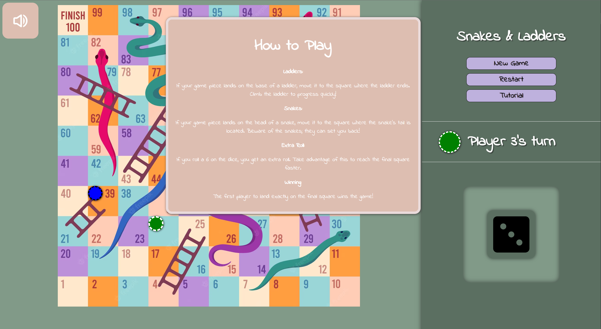
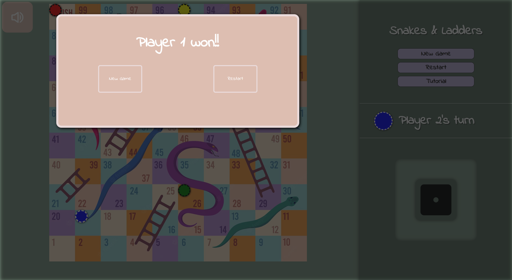

# Snake & Ladders JavaScript Game!
This was a short project made by a group of TE4 student at NTI gymnasiet in Sweden.  

The goal of the project was to produce a short and simple game using only HTML/CSS/JS to practice for doing JS certificates. We hade only 4 days to complete our short challange and this is what we managed to produce.

## Front page

Player selection

## The game

WINNING

